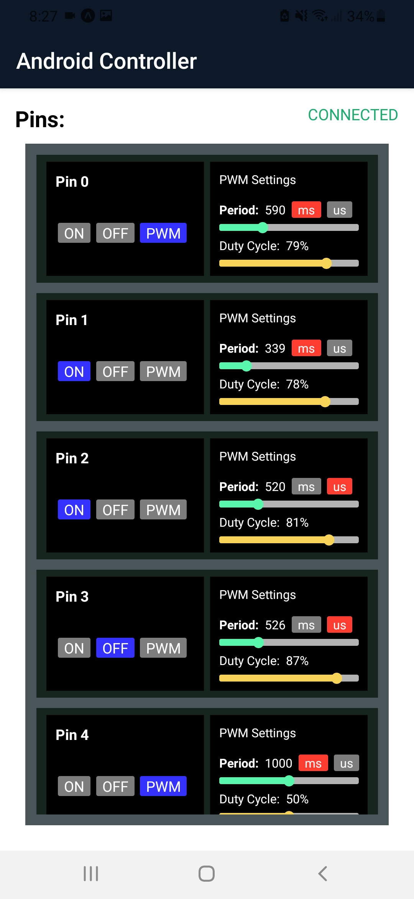
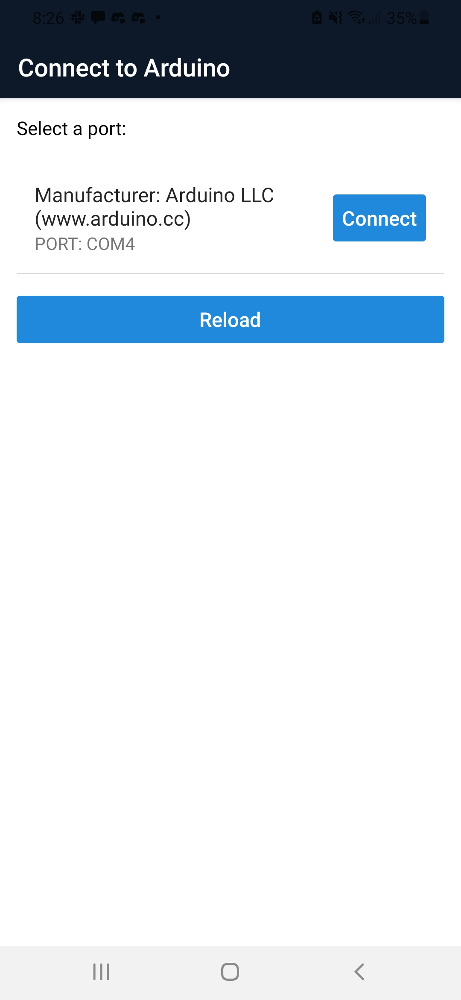
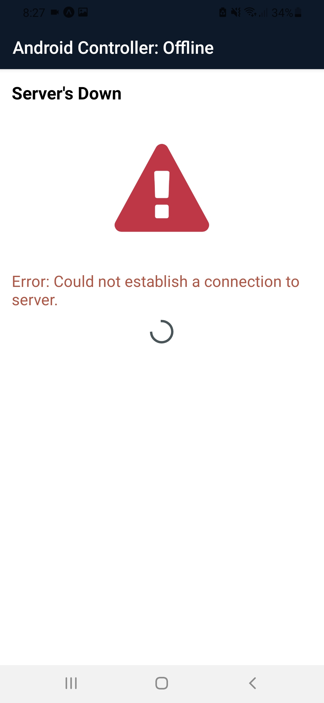
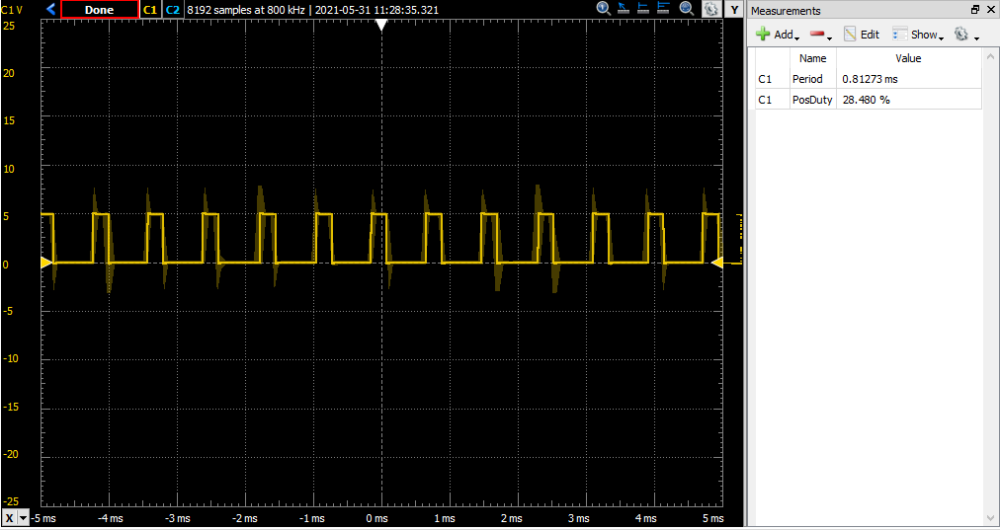
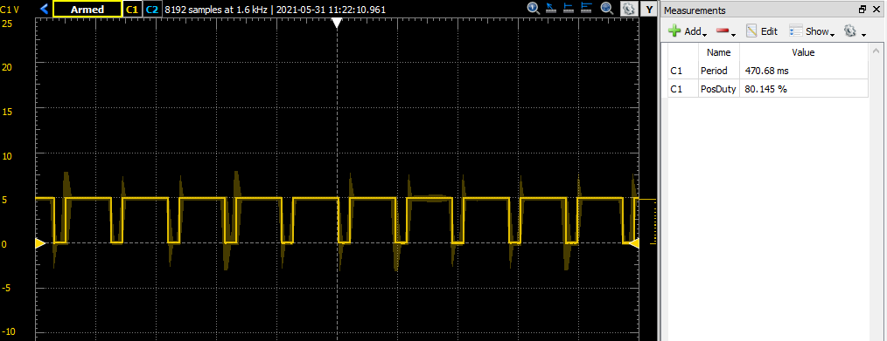

# Arduino IoT
 
 
 
 A mobile app controller project using React Native with the ability to generate pulse-width-modulation, turn on, turn off each individual pin of an Arduino.

Controller UI          |  Serial Port Selection |  Server Down
:-------------------------:|:-------------------------:|:-------------------------:
  | |  


## Features

- Can toggle each pin ON/OFF or enable pulse-width-modulation
- Can specify period in either milliseconds or microseconds and also the duty cycle
- Ability to connect multiple clients and synchronize the state in between them.


## Sample waveforms:

Period: 800us, duty cycle: 30%



Period: 470ms, duty cycle: 80%




That's how the UI looks on my web browser. The design could be improved but the functionality works.

## Installation

1. Download the file `arduino.cpp` and upload this code to your Arduino. Instructions can be found on the Arduino <a href="https://www.arduino.cc/">website</a>.
2. You need to install [Node.js](https://nodejs.org/) on your computer.
3. Create a file called `.env` on the main directory of the project and then specify your LAN address and the ports that you want to use as follows:
```
WSOCKET_PORT=WEBSOCKET_PORT
HTTP_PORT=SOME HTTP PORT TO USE
SERVER_IP=LAN IP ADDRESS
```

4. Go to the folder `android-controller-server` and copy the same `.env` file on that directory.
5. Go to the main directory and run:

```
npm start
```

6. You'll be able to run the app through [Expo](https://expo.dev/) or you can build it and export it to Android or iOS.

## License
MIT
